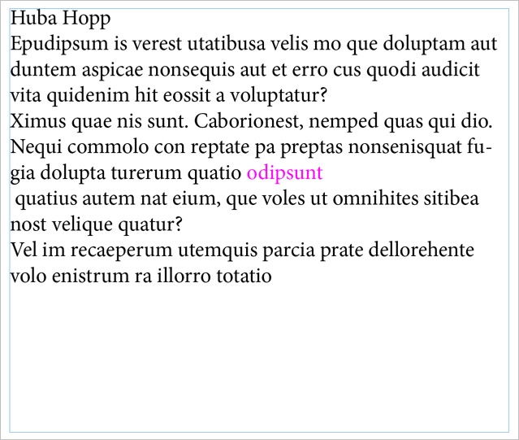
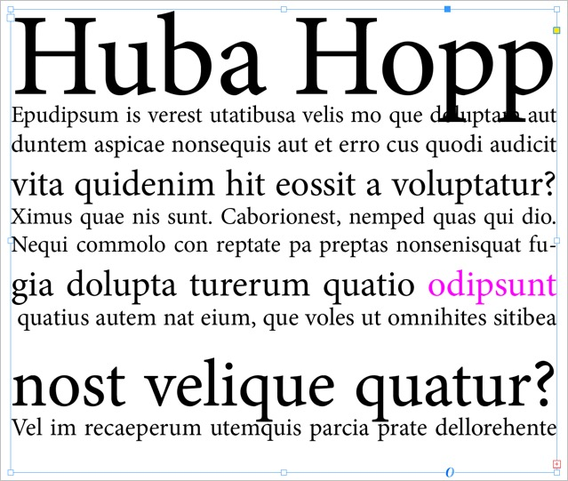

# Justify lines by adjusting point size

A simple script from 2007 that turns this...

...into this:

Linebreaks are preserved by first entering a FORCED_LINEBREAK special character (i.e. \\n)

If you're interested: my [test-document](./assets/justify_by_size.idml)

